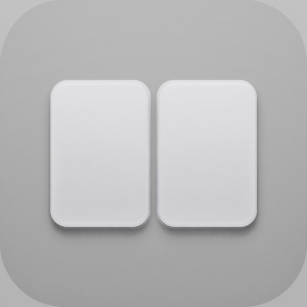
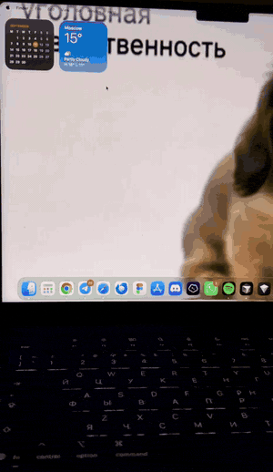
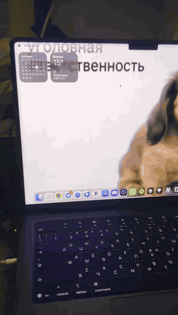

<div align="center">
  
  <h1>Linger</h1>
  <p>
    <strong>English</strong> · <a href="README.ru.md">Русский</a>
  </p>
  <p>
    <a href="https://github.com/c1osed1/MacBookDuo/releases"></a>
    <a href="https://github.com/c1osed1/MacBookDuo/actions/workflows/ci.yml"></a>
  </p>
  <p><strong>Close the lid. The screen stays in the room.</strong></p>
  <p>
    The iPhone Duo lid-fold, on a MacBook — driven by the real hinge,
    not a cut between screens.
  </p>
</div>

<p align="center">
  <a href="https://github.com/c1osed1/MacBookDuo/releases/latest"><strong>Download the latest release →</strong></a>
</p>

<div align="center">
  <table>
    <tr>
      <td align="center" width="50%">
        <p><strong>Glass</strong><br/><sub>Freeze one frame. Recede.</sub></p>
        
      </td>
      <td align="center" width="50%">
        <p><strong>Duo+</strong><br/><sub>Live desktop. Warped around the hinge.</sub></p>
        
      </td>
    </tr>
  </table>
</div>

Close a MacBook and the picture usually just dies. Linger keeps it on a 3D pane that follows the lid — **Glass** freezes a frame, **Duo+** keeps the live desktop and folds it around the hinge, **Frost** pins that picture in the room and milks it as the lid sweeps through.

Opens like System Settings. Close the window and it leaves the Dock; the fold keeps running from the menu bar extra.

The UI follows the system language: English or Russian.

## Three looks

- **Glass** — one frozen frame, then a receding pane.
- **Duo+** — live desktop, hinged sheet, lean and perspective.
- **Frost** — same live picture, world-locked, soft frost toward the far edge.

Pick one in **Look**. Overlay stays on the built-in Liquid Retina display.

<p align="center">
  <video src="docs/look-ui.mp4" width="680" autoplay loop muted playsinline>
    <a href="docs/look-ui.mp4">Linger Look settings</a>
  </video>
</p>

## Use

1. [Download](https://github.com/c1osed1/MacBookDuo/releases/latest) or build and launch.
2. Grant **Screen Recording** when macOS asks.
3. Close the lid slowly — or hit **Preview**.
4. Close the window to hide the Dock icon. Quit from the menu bar extra so capture stops.

Needs a MacBook with a lid-angle sensor (recent Apple silicon), macOS 15+, and Screen Recording. Capture runs only while the fold is visible.

## Build

```bash
xcodebuild -project MacBookDuo.xcodeproj -scheme MacBookDuo -configuration Debug
```

Sign with **Apple Development** so Screen Recording survives rebuilds. Ad-hoc signing (`CODE_SIGN_IDENTITY = "-"`) makes TCC treat every build as a new app. If you clone the repo, set `DEVELOPMENT_TEAM` on the target to your team.

## Releases

GitHub Actions builds every push to `main`. A GitHub Release ships only when the **tip commit** contains `[RELEASE]`.

CI ships a drag-to-Applications DMG (ad-hoc signed). Gatekeeper may block the first launch: right-click → Open. For daily use, build locally with your Apple Development identity.

## How it works

The hinge is a real HID sensor. ScreenCaptureKit grabs the built-in display; Metal draws the fold. Glass freezes one frame and stops. Duo+ and Frost stay live and warp that picture around the lid.

Capture never leaves the Mac. It is excluded from this app’s own windows and torn down on quit.

## License

[MIT](LICENSE). See [NOTICE](NOTICE) for trademark notes. Not affiliated with Apple.
