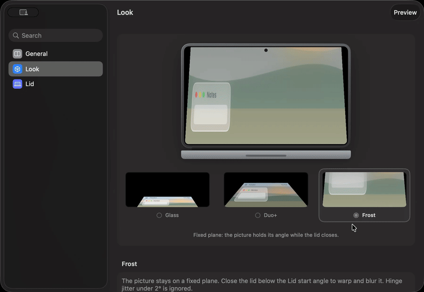

<div align="center">
  
  <h1>MacBook Duo</h1>
  <p>
    <a href="README.md">English</a> · <strong>Русский</strong>
  </p>
  <p>
    <a href="https://github.com/c1osed1/MacBookDuo/releases"></a>
    <a href="https://github.com/c1osed1/MacBookDuo/actions/workflows/ci.yml"></a>
  </p>
  <p><strong>Закройте крышку. Картинка остаётся в комнате.</strong></p>
  <p>
    Складка крышки как у iPhone Duo, но на MacBook — по настоящему шарниру,
    а не склейка двух экранов.
  </p>
</div>

<p align="center">
  <a href="https://github.com/c1osed1/MacBookDuo/releases/latest"><strong>Скачать последний релиз →</strong></a>
</p>

<div align="center">
  <table>
    <tr>
      <td align="center" width="50%">
        <p><strong>Glass</strong><br/><sub>Заморозить кадр. Увести назад.</sub></p>
        
      </td>
      <td align="center" width="50%">
        <p><strong>Duo+</strong><br/><sub>Живой стол. Гнётся вокруг петли.</sub></p>
        
      </td>
    </tr>
  </table>
</div>

Обычно при закрытии крышки картинка просто гаснет. MacBook Duo держит её на 3D-плоскости, которая следует за крышкой — **Glass** замораживает кадр, **Duo+** оставляет живой стол и складывает его вокруг петли, **Frost** фиксирует картинку в комнате и уводит её молоком, пока крышка проходит сквозь неё.

Окно как у Системных настроек. Закройте его — иконка уйдёт из Dock; складка продолжает работать из меню-бара.

Интерфейс на английском и русском: берётся язык системы.

## Три вида

- **Glass** — один замороженный кадр, затем панель уезжает назад.
- **Duo+** — живой стол, лист на шарнире, наклон и перспектива.
- **Frost** — та же живая картинка, стоит в комнате, мягкое молоко к дальнему краю.

Выбор в разделе **Вид**. Оверлей только на встроенном Liquid Retina.

<p align="center">
  
</p>

## Как пользоваться

1. [Скачайте](https://github.com/c1osed1/MacBookDuo/releases/latest) или соберите и запустите.
2. Разрешите **Запись экрана**, когда спросит macOS.
3. Медленно закройте крышку — или нажмите **Превью**.
4. Закройте окно, чтобы убрать иконку из Dock. Выходите из меню-бара, чтобы захват остановился.

Нужен MacBook с датчиком угла крышки (свежий Apple silicon), macOS 15+ и Запись экрана. Захват идёт только пока видна складка.

## Сборка

```bash
xcodebuild -project MacBookDuo.xcodeproj -scheme MacBookDuo -configuration Debug
```

Подписывайте **Apple Development**, чтобы разрешение на запись экрана не слетало после пересборки. Ad-hoc (`CODE_SIGN_IDENTITY = "-"`) заставляет TCC считать каждый билд новым приложением. Если клонируете репозиторий, поставьте `DEVELOPMENT_TEAM` на таргете.

## Релизы

GitHub Actions собирает каждый пуш в `main`. GitHub Release выходит только если в **последнем коммите** есть `[RELEASE]`.

CI кладёт DMG «перетащи в Applications» (ad-hoc подпись). Gatekeeper может закрыть первый запуск: правый клик → Открыть. Для ежедневной работы собирайте локально со своим Apple Development.

## Как это устроено

Шарнир — настоящий HID-датчик. ScreenCaptureKit берёт встроенный дисплей; Metal рисует складку. Glass замораживает один кадр и останавливает захват. Duo+ и Frost остаются живыми и гнут картинку вокруг крышки.

Захват не уходит с Mac. Окна этого приложения из него исключены, при выходе поток гасится.

## Лицензия

[MIT](LICENSE). Товарные знаки — в [NOTICE](NOTICE). Не связано с Apple.
